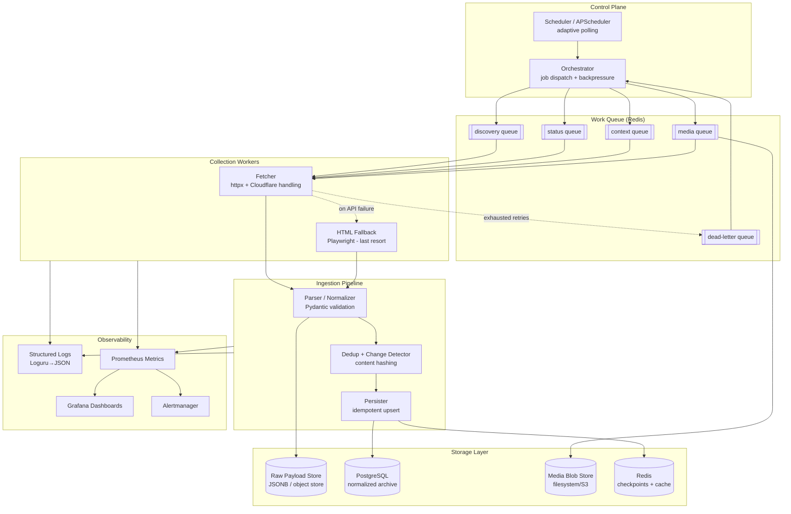
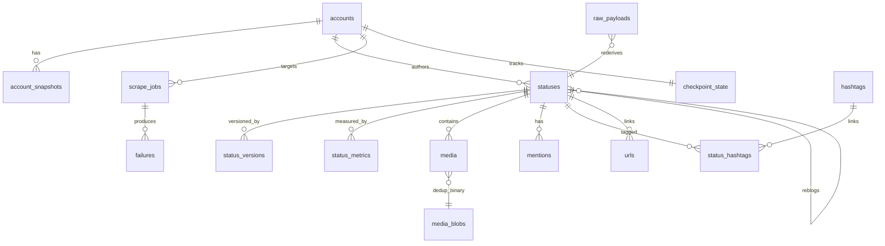

# Design Document: Single-Account Truth Social Archival System

**Status:** Draft for review · **Author:** Archival Systems · **Last updated:** 2026-07-22
**Scope:** Continuously archive all publicly accessible content from a single Truth Social account (`@realDonaldTrump`) for personal research and archival use.

---

## 0. Preamble — The One Fact That Shapes Everything

**Truth Social is a fork of Mastodon.** Its backend is [Soapbox](https://soapbox.pub/) running on top of a modified Mastodon server, and the public web client is a Soapbox/`soapbox-fe` single-page app. This has three enormous engineering consequences that a senior engineer must design around *before* reaching for a headless browser:

1. **There is a documented, structured REST API.** Because it is Mastodon-compatible, endpoints like `GET /api/v1/accounts/lookup`, `GET /api/v1/accounts/:id/statuses`, and `GET /api/v1/statuses/:id/context` exist and return clean JSON. The web SPA itself calls these. **You almost never need to parse rendered HTML.** Structured API consumption is dramatically more robust, cheaper, and higher-fidelity than DOM scraping.

2. **Content is delivered as JSON objects with stable IDs and rich metadata** (post ID, created_at, edited_at, reblog pointer, media attachments, mentions, tags, card previews, counts). This is a gift for deduplication, edit detection, and normalization — the hardest parts of any archiver are partially solved by the data model itself.

3. **Access is gated and hostile to automation.** Truth Social has historically required an authenticated session/bearer token for most API reads, aggressively Cloudflare-fences its endpoints, geoblocks some regions, and its Terms of Service restrict automated access. **This is the central risk and compliance constraint of the whole project** (see §1.8 and §5).

> **Design principle:** Prefer the structured JSON API surface (Mastodon-compatible) as the *primary* collection strategy; treat headless-browser HTML scraping as a *fallback of last resort* for fields the API omits or when the API is unreachable. The rest of this document is written accordingly.

---

# SECTION 1 — Project Goals

## 1.1 Purpose

Build a **continuously running, self-healing archival service** that maintains a complete, historically faithful, deduplicated local copy of one Truth Social account's publicly visible output — posts, reposts (reblogs), publicly visible replies, and media references — plus the ability to detect edits and deletions over time. The archive is optimized for **long-term preservation and research querying**, not one-time export.

The emphasis word is **archive**, not "scraper." A scraper pulls data once; an archive is a living dataset with provenance, versioning, integrity guarantees, and the ability to answer "what did this account look like on date X" and "what changed."

## 1.2 Functional Requirements

| ID | Requirement |
|----|-------------|
| FR-1 | Discover and persist the target account's profile object and track changes to it over time (display name, bio, follower/following counts, avatar/header URLs). |
| FR-2 | Archive all publicly accessible posts (statuses) authored by the account, back to the earliest retrievable post. |
| FR-3 | Archive reposts/reblogs the account makes, preserving the pointer to the original status and a snapshot of the original. |
| FR-4 | Archive publicly visible replies in a status's conversation context (both replies *by* the account and, where in scope, replies *to* the account's posts). |
| FR-5 | Record all media references (image/video/audio attachment URLs, dimensions, blurhash, alt text) and optionally download and checksum the binaries. |
| FR-6 | Detect edits (via `edited_at` and content-hash comparison) and preserve every historical version. |
| FR-7 | Detect deletions (a previously seen status that returns 404/410 or disappears from listings) and mark it deleted without destroying the archived copy. |
| FR-8 | Continuously monitor for new content with adaptive polling. |
| FR-9 | Resume automatically after process, network, or host failure with no data loss and no manual intervention. |
| FR-10 | Never create duplicate records; enforce idempotency at the storage layer. |
| FR-11 | Maintain immutable historical integrity — archived content is append-only; corrections are new versions, never in-place destructive edits. |
| FR-12 | Expose the archive for querying (SQL now; API/search later). |

## 1.3 Non-Functional Requirements

- **Correctness/fidelity first.** A missed post is worse than a slow archive. Completeness and integrity outrank throughput.
- **Idempotency everywhere.** Any job can be run twice with identical end-state.
- **Observability.** Every run is measurable; silent failure is unacceptable for an archiver.
- **Politeness.** Conservative request rates, honoring server signals (`Retry-After`, 429s), single-tenant load.
- **Portability.** Runs on a single small Linux VM or a laptop; no mandatory cloud service.
- **Recoverability.** Full rebuild of derived state from raw captured payloads.
- **Low operational burden.** One operator should run this indefinitely with minimal babysitting.

## 1.4 Scalability Goals

The immediate target is **one account**, but the design must scale to **N accounts** without re-architecture. Concretely: the account identity is a first-class row, not a hardcoded constant; the scheduler operates on a *set* of monitored targets; storage is partition-friendly by account. Vertical scale (one busy account produces at most a few hundred posts/day) is trivial; the real scaling axis is **breadth (more accounts)** and **time depth (years of history)**, not request volume. We design for tens of accounts and millions of statuses on a single Postgres instance — well within its comfort zone.

## 1.5 Reliability Goals

- **RPO (Recovery Point Objective):** zero committed-data loss. Once a payload is captured and persisted to the raw store, it survives crashes.
- **RTO (Recovery Time Objective):** automatic restart within seconds (systemd/Docker restart policy); resume from last checkpoint without re-fetching everything.
- **At-least-once capture with exactly-once storage:** the network layer may retry and re-deliver; the storage layer deduplicates so the archive is exactly-once.
- **No head-of-line data loss:** one failing status must not block the ingestion of others; failures are quarantined to a dead-letter table for later retry.

## 1.6 Maintainability Goals

- Clear separation between **fetch** (talk to network), **parse/normalize** (interpret payloads), and **persist** (write to DB). Each is independently testable.
- **Anti-corruption layer:** the external JSON schema is version-tolerant; parser validates and adapts. When Truth Social changes its API shape, only the parser/adapters change.
- **Raw-payload preservation** (see §8) means we can re-derive normalized tables after a parser bug fix, without re-scraping.
- Strong typing (Pydantic models) as the contract between layers.
- Comprehensive tests using **recorded real payloads as fixtures** (VCR-style), so parser regressions are caught in CI.

## 1.7 Security Considerations

- **Secret handling:** any auth token/session credential lives only in environment variables or a secrets file with `600` perms, never in the repo, never in logs. Logging middleware scrubs `Authorization` headers and tokens.
- **Least privilege:** the DB user the app uses has only the grants it needs. The archive host is firewalled; no inbound ports except SSH.
- **Supply chain:** pinned dependencies with hashes (`pip-compile`/`uv` lockfile), Dependabot/`pip-audit` in CI.
- **Data at rest:** archive may contain large volumes of one public figure's content; still, disk encryption on the host is recommended, and DB access is credential-gated.
- **Blast radius:** the collector is read-only against the target; it can never post, delete, or modify anything on Truth Social. This is enforced by only ever issuing `GET` requests.

## 1.8 Ethical & Legal Considerations (READ THIS BEFORE BUILDING)

This is not boilerplate; it is a gating design input. **This system is explicitly scoped to *publicly accessible* content of a *single public-figure account* for *personal research and archival* purposes.** Even so:

1. **Terms of Service.** Truth Social's ToS restricts automated access/scraping and use of the API outside its intended app. Automated collection may breach the contractual ToS even for public data. The system must be built so the operator can make an informed choice: the design flags every point where a technical action likely conflicts with ToS. **This document does not assert that scraping is ToS-compliant; it documents the limitation and provides compliant-by-preference alternatives.**

2. **robots.txt and machine-readable directives.** The crawler MUST fetch and honor `https://truthsocial.com/robots.txt` and any `X-Robots-Tag`/meta directives before crawling HTML surfaces. If robots disallows a path, the HTML fallback for that path is disabled by configuration and by code default (`RESPECT_ROBOTS = True`, not overridable without an explicit, logged operator acknowledgment).

3. **Authentication boundary.** Content that requires logging in is, by definition, **not "publicly accessible."** The scope of this project is public content only. If the API requires a bearer token merely as an anti-abuse gate on *otherwise-public* data, that is a genuinely grey area; the design keeps auth optional and *off by default*, and documents that enabling it is an operator decision with ToS implications. The system must **never** attempt to access private/follower-only/DM content.

4. **Rate & load ethics.** Single-tenant, low-QPS, backoff-on-signal. The archiver must never degrade the service for others. Politeness limits are conservative *by default* and cannot be trivially disabled.

5. **Legal frameworks to be aware of** (operator's responsibility to evaluate for their jurisdiction; not legal advice): the CFAA and analogous computer-misuse laws (note *hiQ v. LinkedIn* narrowed but did not eliminate scraping risk, and *Van Buren* reshaped "authorized access"), contract/ToS-breach exposure, copyright in the posts and especially the media (archiving for personal research may implicate fair-use analysis; **redistribution is a separate, higher-risk act not in scope**), and data-protection law where applicable.

6. **Preferred compliant alternatives, evaluated first:**
   - **Official/licensed data access:** If a licensed feed or official export exists, prefer it. (As of writing, Truth Social offers no public bulk/archival API license for third parties; document this and revisit.)
   - **Mastodon-compatible API with the operator's own authenticated account, used within ToS-permitted personal use** — a lighter-weight, lower-risk path than HTML scraping if the operator accepts the ToS.
   - **Public third-party archives / research datasets** (e.g., existing academic or journalistic Truth Social datasets) may already cover this account and moot the need to collect at all.
   - **Manual/官方 export** if the account holder cooperates (not applicable here, but the general pattern).

> **Recommendation:** Build the system so its *default* posture is the most conservative (robots-respecting, no auth, low rate, public-only). Make every escalation (enabling auth, enabling HTML fallback on a disallowed path) an explicit, logged, config-gated operator decision. This keeps the engineering artifact useful while placing the compliance choice where it belongs — with the human operator.

---

# SECTION 2 — Architecture

## 2.1 High-Level Architecture



## 2.2 Component Descriptions & Rationale

| Component | Responsibility | Why it exists |
|-----------|----------------|---------------|
| **Scheduler** | Decides *when* to poll each target and each job type; adaptive interval based on recent post frequency. | Continuous monitoring requires a time-driven trigger; adaptive intervals balance freshness vs. politeness. |
| **Orchestrator** | Converts schedule ticks into concrete jobs, enforces global concurrency/backpressure, drains the DLQ on a cadence. | Decouples *when* from *what*; single choke point for rate control and recovery. |
| **Work Queue (Redis)** | Durable-ish queues per job type + dead-letter queue. | Decouples producers from workers; enables retry, priority, and crash-safe resumption. |
| **Fetcher** | Executes HTTP GETs against the Mastodon-compatible API, handles pagination, rate-limit headers, Cloudflare, retries. | The single place that touches the network — the only component that needs to understand transport concerns. |
| **HTML Fallback (Playwright)** | Last-resort renderer for surfaces the API can't provide or when API is blocked; robots-gated. | Resilience against API changes/blocks — but isolated so its fragility doesn't infect the main path. |
| **Parser/Normalizer** | Validate raw JSON against Pydantic models; map to internal domain entities. | Anti-corruption layer; isolates the rest of the system from upstream schema drift. |
| **Dedup + Change Detector** | Compute content hashes, compare against last-seen version, classify as new/unchanged/edited/deleted. | Core of "never duplicate" and "detect edits/deletes." |
| **Persister** | Idempotent upserts into normalized tables inside a transaction. | Guarantees exactly-once storage and referential integrity. |
| **Raw Payload Store** | Append-only capture of every raw response (JSONB column and/or compressed object files). | Enables re-derivation after parser fixes; forensic/provenance record; the archive's source of truth. |
| **PostgreSQL** | Normalized, queryable archive. | Relational integrity, powerful querying, JSONB flexibility, mature ops. |
| **Media Blob Store** | Optional binary copies of media, content-addressed by checksum. | Media URLs rot; binaries must be captured to truly "archive." |
| **Redis (state)** | Checkpoints, cursors, dedup bloom/cache, rate-limit tokens. | Fast shared state across workers and restarts. |
| **Observability stack** | Logs, metrics, dashboards, alerts. | An unobserved archiver silently rots; this is non-negotiable for long-running collection. |

## 2.3 Data Flow (happy path)

1. Scheduler fires a `poll(target)` tick.
2. Orchestrator enqueues a **discovery** job (fetch profile + latest statuses page).
3. Fetcher pulls `/api/v1/accounts/:id/statuses?limit=40` (newest first), reading the `Link` header for pagination cursors.
4. Each raw status payload is written to the **Raw Store** immediately (capture-before-process).
5. Parser validates → domain objects. New status IDs unseen before → enqueue **context** jobs (to get replies) and **media** jobs.
6. Dedup/Change-detector compares content hash vs. stored version → new / edited / unchanged.
7. Persister upserts within a transaction; updates checkpoint cursor in Redis + `checkpoint_state` table.
8. Metrics/logs emitted at each stage.

## 2.4 Scraper Lifecycle (per target)

```
BOOTSTRAP → BACKFILL → STEADY-STATE MONITOR → (RE-SYNC | RECOVER) → …
```

- **Bootstrap:** resolve handle → account ID (`/api/v1/accounts/lookup?acct=realDonaldTrump`), capture profile, initialize checkpoint.
- **Backfill:** page backwards through `max_id` cursors to the earliest retrievable status. Long-running, resumable, checkpointed every page.
- **Steady-state monitor:** poll forward using `since_id`/`min_id` for new content on an adaptive interval.
- **Re-sync:** periodic sweep of recent-window statuses to catch edits/deletes and late-visible replies.
- **Recover:** on restart, read checkpoints and resume both backfill and monitor from exact cursors.

## 2.5 Scheduler, Storage, Monitoring, Logging, Recovery

These are covered in depth in §7 (Scheduling), §6 (Storage/DB), §10 (Observability), and §9 (Error handling/Recovery). Architecturally, the key decisions are: (a) **checkpoints are authoritative and persisted transactionally with data**, so recovery is deterministic; (b) **raw capture precedes normalization**, so no in-flight data is lost on crash; (c) **the DLQ makes failures first-class**, so partial failures are visible and retryable rather than silent.

---

# SECTION 3 — Technology Stack

Recommendations with tradeoffs. The bias is toward **boring, proven, single-node-friendly** technology, because an archiver's virtue is running untouched for years.

| Concern | Recommended | Alternatives considered | Why / Tradeoff |
|---------|-------------|--------------------------|----------------|
| **Language** | **Python 3.12+** | Go, Node/TS | Best-in-class scraping/parsing ecosystem; team familiarity; async maturity. Tradeoff: slower than Go, but this workload is I/O-bound so it's irrelevant. |
| **HTTP client** | **httpx** (async) | requests, aiohttp | HTTP/2, async + sync parity, connection pooling, timeouts. requests is sync-only; aiohttp is async-only and clunkier. httpx gives one API for both. |
| **HTML fallback / JS rendering** | **Playwright** | Selenium, curl_cffi | Only for the last-resort HTML path and for defeating JS/Cloudflare challenges when API is blocked. Playwright > Selenium on reliability and modern browser control. **curl_cffi** is a strong lighter-weight alternative for TLS-fingerprint impersonation without a full browser — recommended as a middle tier between httpx and Playwright. |
| **HTML parsing** | **selectolax** (or lxml) | BeautifulSoup | Only used in fallback path. selectolax (Modest/Lexbor) is far faster than BS4; lxml is the robust default. BS4 is convenient but slow — acceptable given fallback is rare. |
| **Data validation/typing** | **Pydantic v2** | dataclasses + manual, attrs | The anti-corruption contract between layers; v2 is fast (Rust core) and gives us schema-tolerant parsing + serialization. |
| **ORM / DB access** | **SQLAlchemy 2.0** (Core + ORM) | raw psycopg, Tortoise, Peewee | Mature, supports async, powerful upsert/`ON CONFLICT`, migrations via Alembic. Tradeoff: learning curve; worth it. |
| **Migrations** | **Alembic** | manual SQL, yoyo | Versioned, reversible schema changes — mandatory for a long-lived archive whose schema will evolve. |
| **Primary DB** | **PostgreSQL 16** | SQLite, MySQL, Mongo | JSONB (store raw + normalized together), strong constraints, partial/GIN indexes, full-text search, partitioning, `ON CONFLICT` upserts, generated columns. **SQLite** is the recommended default for a *pure single-account, single-process* deployment (zero-ops, single file, trivially backed up) — but we recommend **Postgres** because the design must scale to N accounts and concurrent workers, where SQLite's write-concurrency and lack of native JSONB indexing hurt. |
| **State/queue/cache** | **Redis 7** | RabbitMQ, in-DB queue, Kafka | Doubles as work queue, checkpoint cache, rate-limit token bucket, and dedup cache. RabbitMQ/Kafka are overkill for single-account volumes. **In-Postgres queue (`SELECT … FOR UPDATE SKIP LOCKED`)** is a viable zero-extra-infra alternative and is recommended if you want to drop Redis entirely for a minimal deployment. |
| **Task execution** | **Celery** (with Redis broker) *or* **APScheduler + custom async workers** | Dramatiq, RQ, Arq, raw asyncio | **For the single-account MVP, prefer APScheduler + an asyncio worker pool** — far less operational weight. **Graduate to Celery** when scaling to many accounts or needing distributed workers, retries, and beat scheduling. Dramatiq/Arq are lighter Celery alternatives worth considering. |
| **Scheduler** | **APScheduler** | cron, Celery beat, systemd timers | In-process, adaptive, programmable intervals (needed for adaptive polling). cron can't do adaptive intervals cleanly. |
| **CLI** | **Typer** | argparse, Click | Type-hint-driven, ergonomic; great for `archiver backfill`, `archiver monitor`, `archiver reprocess` commands. |
| **Console/UX** | **Rich** | plain logging | Human-friendly progress bars/tables for interactive runs and backfill progress. |
| **Logging** | **Loguru** → JSON sink | stdlib logging, structlog | Loguru is ergonomic; **structlog** is the more "correct" structured-logging choice and equally acceptable. Emit JSON in prod for ingestion. |
| **Metrics** | **Prometheus client** | StatsD, OpenTelemetry | Pull-based, pairs with Grafana; OTel is the future-proof alternative if you want traces too. |
| **Dashboards** | **Grafana** | Datadog, Kibana | Free, self-hostable, Prometheus-native. |
| **Containerization** | **Docker + Docker Compose** | Podman, bare venv, k8s | Compose orchestrates app+Postgres+Redis+Grafana on one host. k8s is overkill for one account. A **plain venv + systemd** deployment is also fully supported (see §13). |
| **Dependency mgmt** | **uv** (or Poetry) | pip-tools, pipenv | uv is fast and does locking + venv; Poetry is the mature alternative. Pin with a lockfile + hashes. |
| **Testing** | **pytest** (+ pytest-asyncio, respx, testcontainers) | unittest | respx mocks httpx; testcontainers spins real Postgres for integration tests; VCR-style recorded payloads for parser tests. |
| **CI/CD** | **GitHub Actions** | GitLab CI, Jenkins | Lint, type-check (mypy), test matrix, build+push image, `pip-audit`. |
| **Formatting/lint** | **Ruff + mypy** | flake8+black+isort | Ruff replaces the whole trio and is instantaneous; mypy for static types. |

**Overall stack tradeoff summary:** we deliberately choose a **two-tier deployment story** — a *minimal* profile (SQLite + APScheduler + in-process workers, no Redis/Celery) for the literal single-account ask, and a *scale* profile (Postgres + Redis + Celery) that the same codebase grows into. The code targets the abstractions (a `Queue` interface, a `Repository` interface) so switching profiles is configuration, not rewrite.

---

# SECTION 4 — Folder Structure

```
truthsocial-archiver/
├── README.md
├── DESIGN.md                        # this document
├── pyproject.toml                   # deps, tool config (ruff, mypy, pytest)
├── uv.lock                          # pinned, hashed lockfile
├── .env.example                     # documented env vars (no secrets)
├── docker-compose.yml               # app + postgres + redis + grafana + prometheus
├── docker-compose.override.yml      # local dev overrides
├── Dockerfile
├── Makefile                         # make up / test / lint / migrate / backfill
│
├── src/
│   └── archiver/
│       ├── __init__.py
│       ├── main.py                  # process entrypoint (wires DI container)
│       ├── cli.py                   # Typer app: backfill / monitor / reprocess / status
│       │
│       ├── config/
│       │   ├── settings.py          # Pydantic Settings; env + file + profile loading
│       │   ├── profiles/            # dev.yaml / test.yaml / prod.yaml
│       │   └── logging.py           # Loguru/structlog config, secret scrubbing
│       │
│       ├── domain/                  # pure domain models & value objects (no I/O)
│       │   ├── entities.py          # Account, Status, MediaRef, Mention, Tag…
│       │   ├── events.py            # StatusDiscovered, StatusEdited, StatusDeleted…
│       │   └── hashing.py           # canonical content-hash functions
│       │
│       ├── clients/                 # everything that talks to the network
│       │   ├── base.py              # httpx session factory, retry policy, headers
│       │   ├── mastodon_api.py      # PRIMARY: typed API client (accounts, statuses, context)
│       │   ├── pagination.py        # Link-header + since_id/max_id cursor logic
│       │   ├── rate_limit.py        # token bucket, Retry-After handling
│       │   ├── cloudflare.py        # challenge detection + curl_cffi/Playwright escalation
│       │   └── html_fallback.py     # LAST RESORT: Playwright renderer, robots-gated
│       │
│       ├── parsing/                 # raw payload → validated domain objects
│       │   ├── schemas.py           # Pydantic models mirroring TS/Mastodon JSON
│       │   ├── normalizers.py       # schema → domain entity mapping (anti-corruption)
│       │   └── media.py             # media attachment extraction
│       │
│       ├── pipeline/
│       │   ├── capture.py           # write raw payload before processing
│       │   ├── dedup.py             # change detection: new/unchanged/edited/deleted
│       │   ├── verify.py            # post-write integrity checks
│       │   └── orchestrator.py      # job dispatch, backpressure, DLQ drain
│       │
│       ├── scheduler/
│       │   ├── scheduler.py         # APScheduler wiring
│       │   ├── adaptive.py          # adaptive interval algorithm
│       │   └── jobs.py              # job definitions (discovery/status/context/media)
│       │
│       ├── queue/
│       │   ├── base.py              # Queue interface (abstract)
│       │   ├── redis_queue.py       # Redis implementation
│       │   └── pg_queue.py          # SKIP LOCKED implementation (Redis-free profile)
│       │
│       ├── storage/
│       │   ├── db.py                # engine/session factory
│       │   ├── models.py            # SQLAlchemy ORM models (mirrors §6 schema)
│       │   ├── repositories.py      # Repository pattern: AccountRepo, StatusRepo…
│       │   ├── raw_store.py         # raw payload persistence (JSONB / object files)
│       │   └── media_store.py       # content-addressed blob storage
│       │
│       ├── media/
│       │   └── downloader.py        # optional binary download + checksum
│       │
│       ├── observability/
│       │   ├── metrics.py           # Prometheus counters/histograms/gauges
│       │   ├── health.py            # health/readiness endpoints
│       │   └── tracing.py           # optional OTel spans
│       │
│       └── recovery/
│           ├── checkpoints.py       # checkpoint read/write (transactional)
│           └── resume.py            # startup resume logic
│
├── migrations/                      # Alembic
│   ├── env.py
│   └── versions/
│
├── tests/
│   ├── unit/                        # pure logic: hashing, dedup, adaptive interval
│   ├── parsers/                     # recorded-payload fixtures → parser assertions
│   │   └── fixtures/*.json
│   ├── integration/                 # testcontainers Postgres/Redis
│   ├── e2e/                         # respx-mocked full pipeline runs
│   └── conftest.py
│
├── scripts/
│   ├── seed_fixtures.py             # capture sanitized real payloads for tests
│   ├── reprocess_raw.py             # re-derive normalized tables from raw store
│   └── backup.sh                    # pg_dump + media rsync
│
├── docs/
│   ├── runbook.md                   # ops: restart, recover, backfill, incident response
│   ├── data_dictionary.md           # every table/column documented
│   └── adr/                         # Architecture Decision Records
│
└── deploy/
    ├── systemd/archiver.service     # non-Docker deployment unit
    ├── prometheus/prometheus.yml
    └── grafana/dashboards/*.json
```

**Directory rationale:** the top-level split enforces **dependency direction** — `domain/` depends on nothing; `clients/`, `parsing/`, `storage/` depend on `domain/`; `pipeline/`, `scheduler/`, `queue/` orchestrate them; `main.py` wires everything. This is a ports-and-adapters (hexagonal) layout so that the network and DB are swappable adapters and the core logic is testable in isolation. `migrations/`, `deploy/`, `docs/adr/` exist because a decade-lived archive needs schema evolution, reproducible deployment, and a record of *why* decisions were made.

---

# SECTION 5 — Crawler Design

## 5.1 Profile Discovery

1. Resolve handle → stable account ID once, then cache: `GET /api/v1/accounts/lookup?acct=realDonaldTrump` → `{ id, username, display_name, followers_count, … }`. The **numeric/string account `id` is the durable key**; the handle can change, the ID doesn't.
2. Capture the full account object into `accounts` + append a row to `account_snapshots` (see §6) so profile changes over time (bio edits, follower counts, avatar swaps) are versioned.
3. Re-fetch the profile on a slow cadence (e.g., every few hours) during steady state.

**Fallback if `lookup` is gated:** parse the account ID from the SPA's initial state or from an HTML fallback render of the profile page (robots-permitting).

## 5.2 Post (Status) Discovery

Primary endpoint: `GET /api/v1/accounts/:id/statuses`. Key query parameters (Mastodon semantics):

- `limit` (≤40) — page size.
- `max_id` — return statuses **older than** this ID (backward pagination → backfill).
- `since_id` / `min_id` — return statuses **newer than** this ID (forward pagination → monitoring).
- `exclude_replies`, `exclude_reblogs`, `only_media`, `pinned` — **we set these to include everything** (we want replies and reblogs), and make separate passes as needed since a single call can't express all combinations.

Statuses are ID-ordered (Mastodon IDs are **snowflake-like, time-sortable**), which makes cursoring reliable and gives us a natural dedup/ordering key.

## 5.3 Pagination Strategy

Mastodon returns a **`Link` HTTP header** with `rel="next"` (older, via `max_id`) and `rel="prev"` (newer, via `min_id`). The client:

1. Reads `Link` header first; if present, follow its opaque cursors — this is the most robust method.
2. If absent, fall back to manual cursoring: `max_id = min(id for id in page) ` for the next older page.
3. **Two independent cursors are maintained per target:**
   - `backfill_cursor` (a `max_id`) marching toward the oldest post.
   - `frontier_cursor` (a `since_id`) tracking the newest seen post for monitoring.
4. Backfill terminates when a page returns fewer than `limit` items *and* no `next` link — the archive floor. (Note: platforms sometimes cap history depth; if backfill hits a hard wall before the true earliest post, record the wall and flag it.)

## 5.4 Reply Discovery

For each status we care about, fetch its conversation context: `GET /api/v1/statuses/:id/context` → `{ ancestors: [...], descendants: [...] }`.

- `descendants` = the reply tree beneath the status. We persist replies as ordinary `statuses` rows plus an edge in a `reply_edges`/`in_reply_to` relationship (self-referential FK on `statuses.in_reply_to_id`).
- `ancestors` = the thread above (if the target's post is itself a reply), giving full conversational context.
- **Scope control:** replies *by the target account* are always archived. Replies *by others to the target's posts* are archived if `ARCHIVE_FOREIGN_REPLIES = True` (config), because that can explode in volume and includes third-party content — an operator choice. Only **publicly visible** replies are ever fetched.
- Context is re-fetched on the re-sync sweep because reply trees grow after the parent is first seen.

## 5.5 Media Collection

Each status JSON has `media_attachments[]` with `id`, `type` (image/gifv/video/audio), `url`, `preview_url`, `remote_url`, `meta` (dimensions, duration, fps), `description` (alt text), `blurhash`.

Two tiers:

1. **Reference archival (default):** persist all metadata + URLs into `media` table. Cheap, always on.
2. **Binary archival (optional, `DOWNLOAD_MEDIA=True`):** download the binary, compute SHA-256, store **content-addressed** (`media_blobs/<sha256[:2]>/<sha256>.<ext>`) so identical media dedupes automatically, and record `blob_sha256` + local path. This is essential for true archival because CDN URLs expire, but it's storage-heavy (video), so it's opt-in and rate-limited on its own queue.

Media downloads honor the same politeness/robots rules and are checksummed on write; a mismatch between `Content-Length` and bytes written quarantines the download.

## 5.6 Metadata Collection

From each status we normalize: `id`, `created_at`, `edited_at`, `uri`/`url`, `content` (HTML) + a derived plaintext, `language`, `visibility`, `sensitive`, `spoiler_text`, `replies_count`, `reblogs_count`, `favourites_count`, `in_reply_to_id`, `in_reply_to_account_id`, `reblog` (pointer to reblogged status), `card` (link preview), `mentions[]`, `tags[]`, `emojis[]`, `poll`, and the media set. Counts are volatile, so they go to a time-series snapshot table (§6) rather than being overwritten in place.

## 5.7 Incremental Crawling

Steady-state monitoring uses `since_id = frontier_cursor` to fetch only new statuses. Each poll:

1. `GET …/statuses?since_id=<frontier>&limit=40`.
2. If a full page returns, there may be more new posts than one page — keep paging *newer* until caught up.
3. Advance `frontier_cursor` to the max ID seen; persist checkpoint transactionally with the data.
4. Adaptive interval (see §7) shrinks when the account is active, grows when quiet.

## 5.8 Duplicate Detection

Multiple layers, defense-in-depth:

1. **Natural key uniqueness:** `statuses.id` (the platform status ID) is `PRIMARY KEY`/`UNIQUE`. All writes use `INSERT … ON CONFLICT (id) DO UPDATE` (upsert), so re-fetching the same status is idempotent.
2. **Content hash:** `content_hash = sha256(canonicalize(content, media_ids, poll, spoiler, sensitive))`. Stored per version. If the incoming hash equals the stored current hash → **unchanged**, skip write (except volatile counts). If different → **edited** → new version row.
3. **Redis dedup cache / bloom filter:** a fast pre-check ("have I already fully processed status ID X at hash H?") to avoid even touching Postgres for the overwhelmingly common unchanged case during re-sync sweeps.

Result: exactly-once storage regardless of at-least-once delivery.

## 5.9 Edit & Deletion Detection

- **Edits:** trust `edited_at` when present; corroborate with `content_hash` diff (defends against upstream not always setting `edited_at`). On change, append a row to `status_versions` (immutable), update the "current" pointer on `statuses`. Optionally pull `GET /api/v1/statuses/:id/history` (Mastodon edit history) when available for authoritative version lists.
- **Deletions:** during re-sync, statuses that previously existed but now return **404/410** or vanish from listings are marked `is_deleted = true`, `deleted_detected_at = now()`. **The archived copy and all versions are retained** — deletion is a state transition, never a data purge. This is core to FR-7/FR-11.

## 5.10 Resume Checkpoints

Checkpoints are stored **both** in Redis (fast) and in the `checkpoint_state` table (durable), and are **written in the same DB transaction as the data they attest to**. A checkpoint records: `target_account_id`, `phase` (backfill/monitor/resync), `backfill_cursor`, `frontier_cursor`, `last_page_hash`, `updated_at`. On crash, `recovery/resume.py` reads the durable checkpoint and re-enters the exact phase and cursor. Because raw payloads are captured before normalization, an interrupted page is safely re-fetched and re-processed idempotently.

## 5.11 Historical Synchronization

Two synchronization modes run concurrently:

- **Deep backfill** (one-time-ish, resumable): marches `backfill_cursor` to the archive floor. Runs at low priority so it never starves monitoring.
- **Rolling re-sync** (periodic): re-fetches a sliding window (e.g., the last N days or last M statuses) to catch **edits, deletions, and late-arriving replies/counts**. This is what keeps the archive faithful over time rather than just append-only.

## 5.12 Error Recovery & State Management

- Every job carries `attempt`, `max_attempts`; failures re-enqueue with exponential backoff; terminal failures go to the **DLQ** (`failures` table) with full context (URL, status code, response snippet, traceback hash).
- The DLQ is drained on a schedule; a persistently failing item raises an alert rather than looping forever.
- **State machine per target:** `BOOTSTRAP → BACKFILLING → MONITORING ⇄ RESYNCING → (DEGRADED on repeated failure)`. State transitions are persisted so restarts are deterministic.

---

# SECTION 6 — Database Design

**Design principles:** 3NF for the normalized entities; **JSONB raw capture** kept alongside for re-derivation; **append-only versioning** for content and volatile counts; snowflake platform IDs used as natural keys where stable; all timestamps `TIMESTAMPTZ` in UTC. Below, PK = primary key, FK = foreign key.

### 6.1 `accounts`
Durable identity of a monitored account.

| Column | Type | Notes |
|--------|------|-------|
| `id` | `TEXT` PK | Platform account ID (stable). |
| `username` | `TEXT NOT NULL` | Handle (may change). |
| `acct` | `TEXT` | Full `user@domain` form. |
| `display_name` | `TEXT` | Current display name. |
| `url` | `TEXT` | Profile URL. |
| `created_at` | `TIMESTAMPTZ` | Account creation per platform. |
| `first_seen_at` | `TIMESTAMPTZ NOT NULL` | When we first archived it. |
| `last_checked_at` | `TIMESTAMPTZ` | Last profile poll. |
| `is_active_target` | `BOOLEAN NOT NULL DEFAULT true` | Whether we monitor it. |
| `raw` | `JSONB` | Last full raw account payload. |

Indexes: `UNIQUE(username)` (soft — track history via snapshots), `idx_accounts_active (is_active_target)`.

### 6.2 `account_snapshots`
Time-series of mutable profile fields (bio, counts, avatar). *Normalization note:* separated from `accounts` because these change frequently and we need history — keeping them in `accounts` would either lose history or bloat the row.

| Column | Type | Notes |
|--------|------|-------|
| `id` | `BIGINT` PK (identity) | |
| `account_id` | `TEXT` FK→`accounts.id` | |
| `captured_at` | `TIMESTAMPTZ NOT NULL` | |
| `display_name` | `TEXT` | |
| `note_html` | `TEXT` | Bio HTML. |
| `followers_count` | `BIGINT` | |
| `following_count` | `BIGINT` | |
| `statuses_count` | `BIGINT` | |
| `avatar_url` | `TEXT` | |
| `header_url` | `TEXT` | |
| `content_hash` | `TEXT` | Skip inserting identical consecutive snapshots. |

Indexes: `idx_snap_account_time (account_id, captured_at DESC)`.

### 6.3 `statuses`
Core post table (posts, replies, and reblog wrappers are all statuses — Mastodon model).

| Column | Type | Notes |
|--------|------|-------|
| `id` | `TEXT` PK | Platform status ID (snowflake, time-sortable). |
| `account_id` | `TEXT` FK→`accounts.id` NOT NULL | Author. |
| `created_at` | `TIMESTAMPTZ NOT NULL` | |
| `edited_at` | `TIMESTAMPTZ` | Null if never edited. |
| `url` | `TEXT` | Canonical URL. |
| `uri` | `TEXT` | ActivityPub URI. |
| `in_reply_to_id` | `TEXT` FK→`statuses.id` | Self-ref; null for top-level. |
| `in_reply_to_account_id` | `TEXT` | |
| `reblog_of_id` | `TEXT` FK→`statuses.id` | Set if this status is a repost. |
| `is_reblog` | `BOOLEAN NOT NULL DEFAULT false` | |
| `visibility` | `TEXT` | public/unlisted/etc. (we only store public). |
| `sensitive` | `BOOLEAN` | |
| `spoiler_text` | `TEXT` | CW text. |
| `language` | `TEXT` | |
| `content_html` | `TEXT` | Current version HTML. |
| `content_text` | `TEXT` | Derived plaintext (for search). |
| `content_hash` | `TEXT NOT NULL` | Hash of current version. |
| `current_version` | `INT NOT NULL DEFAULT 1` | |
| `is_deleted` | `BOOLEAN NOT NULL DEFAULT false` | |
| `deleted_detected_at` | `TIMESTAMPTZ` | |
| `first_seen_at` | `TIMESTAMPTZ NOT NULL` | |
| `last_seen_at` | `TIMESTAMPTZ NOT NULL` | Last time confirmed present. |
| `raw` | `JSONB` | Latest raw payload. |

Indexes: `idx_status_account_created (account_id, created_at DESC)`, `idx_status_reply (in_reply_to_id)`, `idx_status_reblog (reblog_of_id)`, `idx_status_deleted (is_deleted)`, GIN on `content_text` (`to_tsvector`) for full-text, GIN on `raw`. **Partitioning** by `created_at` range (yearly) once the table grows large.

*Normalization note:* replies and reblogs are the same entity type (a status) differentiated by nullable FKs, which mirrors the source model and avoids duplicate tables. Foreign-status content referenced by a reblog is stored as its own `statuses` row (with a snapshot), and the wrapper points to it via `reblog_of_id`.

### 6.4 `status_versions`
Immutable edit history. *Normalization:* separated so `statuses` holds only the current pointer while full history is append-only here.

| Column | Type | Notes |
|--------|------|-------|
| `id` | `BIGINT` PK identity | |
| `status_id` | `TEXT` FK→`statuses.id` NOT NULL | |
| `version` | `INT NOT NULL` | 1,2,3… |
| `captured_at` | `TIMESTAMPTZ NOT NULL` | |
| `edited_at` | `TIMESTAMPTZ` | Source-reported edit time. |
| `content_html` | `TEXT` | |
| `content_text` | `TEXT` | |
| `spoiler_text` | `TEXT` | |
| `content_hash` | `TEXT NOT NULL` | |
| `raw` | `JSONB` | Full raw payload for this version. |

Indexes: `UNIQUE(status_id, version)`, `idx_ver_status (status_id, version DESC)`.

### 6.5 `status_metrics`
Time-series of volatile counts. *Normalization:* counts change constantly; storing them in `statuses` would lose history and thrash the row — separate time-series table instead.

| Column | Type | Notes |
|--------|------|-------|
| `id` | `BIGINT` PK identity | |
| `status_id` | `TEXT` FK→`statuses.id` | |
| `captured_at` | `TIMESTAMPTZ NOT NULL` | |
| `replies_count` | `BIGINT` | |
| `reblogs_count` | `BIGINT` | |
| `favourites_count` | `BIGINT` | |

Indexes: `idx_metrics_status_time (status_id, captured_at DESC)`. Candidate for TimescaleDB hypertable at scale.

### 6.6 `media`
Media attachments (references + optional blob linkage).

| Column | Type | Notes |
|--------|------|-------|
| `id` | `TEXT` PK | Platform media ID. |
| `status_id` | `TEXT` FK→`statuses.id` NOT NULL | |
| `type` | `TEXT` | image/gifv/video/audio. |
| `url` | `TEXT` | Full-size CDN URL (rots). |
| `preview_url` | `TEXT` | |
| `remote_url` | `TEXT` | |
| `description` | `TEXT` | Alt text. |
| `blurhash` | `TEXT` | |
| `meta` | `JSONB` | dimensions/duration/fps. |
| `blob_sha256` | `TEXT` FK→`media_blobs.sha256` | Null until/unless downloaded. |
| `first_seen_at` | `TIMESTAMPTZ NOT NULL` | |

Indexes: `idx_media_status (status_id)`, `idx_media_blob (blob_sha256)`.

### 6.7 `media_blobs`
Content-addressed binary store metadata. *Normalization:* deduped by checksum — many `media` rows (across edits/reposts) can point at one blob.

| Column | Type | Notes |
|--------|------|-------|
| `sha256` | `TEXT` PK | Content hash = identity. |
| `byte_size` | `BIGINT` | |
| `mime_type` | `TEXT` | |
| `storage_path` | `TEXT` | Local path or S3 key. |
| `downloaded_at` | `TIMESTAMPTZ` | |

### 6.8 `mentions`
| Column | Type | Notes |
|--------|------|-------|
| `id` | `BIGINT` PK identity | |
| `status_id` | `TEXT` FK→`statuses.id` | |
| `mentioned_account_id` | `TEXT` | Platform ID of mentioned user. |
| `username` | `TEXT` | |
| `acct` | `TEXT` | |
| `url` | `TEXT` | |

Indexes: `UNIQUE(status_id, mentioned_account_id)`, `idx_mentions_acct (mentioned_account_id)`.

### 6.9 `hashtags` + `status_hashtags`
*Normalization:* many-to-many; a tag is an entity, the link is a join table (avoids repeating tag strings).

`hashtags`: `id BIGINT PK`, `name TEXT UNIQUE NOT NULL` (lowercased), `first_seen_at`.
`status_hashtags`: `status_id TEXT FK`, `hashtag_id BIGINT FK`, PK `(status_id, hashtag_id)`.

Index: `idx_sh_tag (hashtag_id)`.

### 6.10 `urls` (link cards / extracted links)
| Column | Type | Notes |
|--------|------|-------|
| `id` | `BIGINT` PK identity | |
| `status_id` | `TEXT` FK→`statuses.id` | |
| `url` | `TEXT NOT NULL` | Extracted/expanded URL. |
| `title` | `TEXT` | From card. |
| `description` | `TEXT` | |
| `provider_name` | `TEXT` | |
| `image_url` | `TEXT` | |

Index: `idx_urls_status (status_id)`, `idx_urls_url (url)`.

### 6.11 `scrape_jobs`
Every unit of work, for auditability and resumability.

| Column | Type | Notes |
|--------|------|-------|
| `id` | `BIGINT` PK identity | |
| `job_type` | `TEXT` | discovery/status/context/media/resync. |
| `target_account_id` | `TEXT` FK→`accounts.id` | |
| `params` | `JSONB` | cursor, status_id, etc. |
| `status` | `TEXT` | queued/running/succeeded/failed/dead. |
| `attempt` | `INT NOT NULL DEFAULT 0` | |
| `max_attempts` | `INT NOT NULL DEFAULT 5` | |
| `scheduled_at` | `TIMESTAMPTZ` | |
| `started_at` | `TIMESTAMPTZ` | |
| `finished_at` | `TIMESTAMPTZ` | |
| `next_retry_at` | `TIMESTAMPTZ` | For backoff. |
| `error_id` | `BIGINT` FK→`failures.id` | Last error. |

Indexes: `idx_jobs_status_retry (status, next_retry_at)`, `idx_jobs_type (job_type)`. This table can *be* the queue in the Redis-free profile via `FOR UPDATE SKIP LOCKED`.

### 6.12 `failures` (dead-letter)
| Column | Type | Notes |
|--------|------|-------|
| `id` | `BIGINT` PK identity | |
| `job_id` | `BIGINT` FK→`scrape_jobs.id` | |
| `occurred_at` | `TIMESTAMPTZ NOT NULL` | |
| `category` | `TEXT` | network/http/parse/db/timeout. |
| `http_status` | `INT` | |
| `message` | `TEXT` | |
| `response_excerpt` | `TEXT` | Truncated body (scrubbed). |
| `traceback_hash` | `TEXT` | Group identical failures. |
| `raw_context` | `JSONB` | |

Indexes: `idx_fail_category_time (category, occurred_at DESC)`, `idx_fail_tb (traceback_hash)`.

### 6.13 `checkpoint_state`
Durable resume cursors (see §5.10).

| Column | Type | Notes |
|--------|------|-------|
| `target_account_id` | `TEXT` PK FK→`accounts.id` | One row per target. |
| `phase` | `TEXT NOT NULL` | backfill/monitor/resync. |
| `backfill_cursor` | `TEXT` | max_id frontier for history. |
| `frontier_cursor` | `TEXT` | since_id for newest seen. |
| `backfill_complete` | `BOOLEAN NOT NULL DEFAULT false` | |
| `last_resync_at` | `TIMESTAMPTZ` | |
| `updated_at` | `TIMESTAMPTZ NOT NULL` | |

### 6.14 `raw_payloads`
Append-only capture (source of truth for re-derivation).

| Column | Type | Notes |
|--------|------|-------|
| `id` | `BIGINT` PK identity | |
| `fetched_at` | `TIMESTAMPTZ NOT NULL` | |
| `endpoint` | `TEXT` | Which API call. |
| `request_params` | `JSONB` | |
| `http_status` | `INT` | |
| `entity_type` | `TEXT` | account/status/context/media. |
| `entity_id` | `TEXT` | If applicable. |
| `payload` | `JSONB` | The raw response. |
| `payload_sha256` | `TEXT` | Dedup identical captures. |

Indexes: `idx_raw_entity (entity_type, entity_id)`, `idx_raw_time (fetched_at DESC)`, `UNIQUE(payload_sha256)` (optional). Large-volume table → partition by `fetched_at` month; consider offloading old partitions to object storage/parquet.

### 6.15 `crawler_metrics`
Operational time-series (also exported to Prometheus; DB copy for long retention).

| Column | Type | Notes |
|--------|------|-------|
| `id` | `BIGINT` PK identity | |
| `captured_at` | `TIMESTAMPTZ NOT NULL` | |
| `metric` | `TEXT` | e.g., statuses_ingested_total. |
| `value` | `DOUBLE PRECISION` | |
| `labels` | `JSONB` | account, job_type, etc. |

Index: `idx_cmetrics (metric, captured_at DESC)`.

### 6.16 Relationship Summary (ERD)



**Overall normalization reasoning:** stable entities (account, status, hashtag, media blob) are 3NF with natural or surrogate keys; **volatile or historical facts** (counts, profile fields, content versions) are pushed into append-only time-series/version tables so the archive is immutable and query-friendly; the **raw JSONB capture** provides denormalized provenance and a rebuild path, deliberately trading some storage for correctness/recoverability.

---

# SECTION 7 — Scheduling

## 7.1 Polling Interval & Adaptive Polling

A fixed interval is wasteful (polls a sleeping account) or laggy (misses a burst). We use an **adaptive interval** bounded by `[MIN_INTERVAL, MAX_INTERVAL]` (e.g., 60s–30min):

```
interval_next = clamp(
    base * f(recent_post_rate) * g(time_of_day) * h(consecutive_empty_polls),
    MIN_INTERVAL, MAX_INTERVAL)
```

- If the last poll found new posts → shrink toward `MIN_INTERVAL` (account is active — bursts cluster).
- Consecutive empty polls → exponential grow toward `MAX_INTERVAL`.
- Optional time-of-day prior from historical posting patterns (accounts have diurnal rhythms).
- Backfill runs independently at a steady low-priority cadence.

This is an AIMD-style controller (fast ramp-up on activity, gradual back-off when quiet), which minimizes both latency-to-capture and request volume.

## 7.2 Rate Limiting

- **Token-bucket** limiter (in Redis for shared state across workers): a global bucket sized well under any observed server limit, plus per-endpoint sub-buckets.
- **Honor server signals authoritatively:** read `X-RateLimit-Remaining` / `X-RateLimit-Reset` (Mastodon exposes these) and **`Retry-After`** on 429/503 — server-stated limits always override our local bucket.
- Conservative defaults; the limiter is **not** trivially disabled (politeness is a design invariant, §1.8).

## 7.3 Retry Strategy & Exponential Backoff

- Retriable: network errors, timeouts, 429, 5xx. Non-retriable: 400/401/403/404/410 (these are semantic — handle, don't hammer).
- **Exponential backoff with full jitter:** `delay = random(0, min(cap, base * 2^attempt))`, `base≈1s`, `cap≈300s`. Jitter prevents thundering-herd on recovery.
- `max_attempts` per job; on exhaustion → DLQ (`failures`) + alert.
- **Circuit breaker:** if the error rate against the host exceeds a threshold, open the breaker (pause all fetching for a cool-down), so a site-wide outage or a block doesn't burn retries or look abusive.

## 7.4 Recovery After Downtime

On startup, `resume.py`:
1. Loads `checkpoint_state` per target.
2. Re-enters `MONITORING` from `frontier_cursor` (fetch everything newer that accumulated during downtime — this may span many pages; page until caught up).
3. Resumes `BACKFILLING` from `backfill_cursor` if incomplete.
4. Requeues jobs left in `running` (crash mid-flight) as `queued` (safe because processing is idempotent).
5. Drains the DLQ for items whose `next_retry_at` has passed.

## 7.5 Priority Queue & Failure Queue

Multiple logical queues, priority-ordered:
1. **P0 monitor** (freshness-critical: new-post detection).
2. **P1 context/media** for newly discovered statuses.
3. **P2 resync** (edits/deletes sweep).
4. **P3 backfill** (history — never starves P0).
5. **DLQ** drained on its own cadence with capped concurrency.

Weighted fair scheduling prevents backfill from monopolizing the rate budget while guaranteeing it still makes progress.

---

# SECTION 8 — Data Pipeline

Stages, each independently testable and instrumented:

1. **Discovery** — enumerate what to fetch (profile, status pages via cursors, contexts, media). Produces jobs.
2. **Fetch** — issue the GET, capture headers + body. Emits raw response.
3. **Capture (raw)** — write the raw payload to `raw_payloads` **before** any parsing (capture-before-process = no data loss on downstream bug/crash).
4. **Parsing** — validate against Pydantic schemas; tolerate unknown/extra fields (forward-compat); on schema violation, quarantine to `failures` with category `parse` but **keep the raw** (so it's re-processable after a parser fix).
5. **Cleaning** — sanitize HTML (allowlist tags), derive plaintext, normalize whitespace/entities, expand shortened URLs where cheaply possible, normalize timestamps to UTC.
6. **Validation** — business rules: required fields present, referential targets resolvable (author account exists or is fetched), media count matches, IDs well-formed.
7. **Normalization** — map to domain entities and the relational model; split volatile counts to `status_metrics`, content to `status_versions`.
8. **Deduplication** — natural-key + content-hash + Redis pre-check (§5.8) → classify new/unchanged/edited/deleted.
9. **Storage** — single transaction: upsert `statuses`, insert version/metrics/media/mentions/tags/urls, update checkpoint. All-or-nothing.
10. **Verification** — post-write read-back / integrity assertions: FK closure (no dangling `in_reply_to_id`), version monotonicity, media-blob checksum match, counts sane. Failures raise integrity alerts.
11. **Monitoring** — every stage emits metrics (latency, counts, error rates) and structured logs (§10).

The pipeline is a directed flow with **idempotent, replayable stages** anchored by the raw store: any downstream logic can be rebuilt by replaying `raw_payloads` through parsing→storage (`scripts/reprocess_raw.py`).

---

# SECTION 9 — Error Handling

| Failure class | Detection | Handling |
|---------------|-----------|----------|
| **Network (DNS, conn reset, TLS)** | httpx exceptions | Retry w/ backoff+jitter; circuit-breaker if widespread. |
| **HTTP 429** | status + `Retry-After` | Respect `Retry-After`; shrink token bucket; requeue. |
| **HTTP 5xx** | status | Retriable backoff; breaker on sustained. |
| **HTTP 401/403** | status | Non-retriable; likely auth/ToS gate or block → **DEGRADED** state, alert operator, do **not** hammer or attempt evasion beyond configured, ToS-aware measures. |
| **HTTP 404/410** | status | Semantic: for a previously-seen status → mark deleted (§5.9); for discovery → end-of-list/removed. |
| **Timeouts** | httpx timeout | Bounded retries; separate connect/read timeouts; escalate to breaker. |
| **Cloudflare / bot challenge** | challenge HTML/JS, 403 w/ CF markers | Detect; escalate httpx → curl_cffi (TLS impersonation) → Playwright, all **robots/ToS-gated and rate-limited**; if still blocked → DEGRADED + alert. Never resort to abusive evasion. |
| **Unexpected HTML (fallback path)** | selector misses, structure change | Parser raises structured error; quarantine to `failures`; alert on parser-error-rate spike; keep raw for post-fix reprocess. |
| **Missing/changed JSON fields** | Pydantic validation | Version-tolerant schema (optional fields, `extra=allow`); log the drift metric; if a *required* field vanishes, quarantine + alert (schema break). |
| **Corrupt records** | verification stage | Reject the write (transaction rollback), quarantine, alert; never persist partial/inconsistent state. |
| **Database failures** | SQLAlchemy exceptions | Retry transient (deadlock, serialization) with backoff; on persistent DB outage, pause workers (backpressure) and buffer raw captures locally; alert. Connection pool with health checks + auto-reconnect. |
| **Media checksum mismatch** | size/hash compare | Discard partial file, requeue download, alert on repeat. |

**Cross-cutting recovery strategy:** capture-before-process + idempotent storage + durable checkpoints + DLQ means **any** failure degrades to "retry later" or "quarantine + alert," never to silent data loss or duplication. The worst case (a hard, sustained block) transitions the target to `DEGRADED`, stops wasteful requests, and pages the operator — the correct behavior for a compliant, polite archiver.

---

# SECTION 10 — Observability

## 10.1 Structured Logging
- **JSON logs** (Loguru or structlog) with consistent fields: `ts`, `level`, `event`, `target_account`, `job_type`, `job_id`, `status_id`, `http_status`, `latency_ms`, `attempt`, `trace_id`.
- **Secret scrubbing** middleware strips `Authorization`, tokens, cookies before emit.
- Log levels: DEBUG (dev), INFO (lifecycle/state transitions), WARNING (retriable failures), ERROR (DLQ/quarantine), CRITICAL (breaker open, DB down).
- Correlation IDs thread a request from schedule → fetch → persist.

## 10.2 Metrics (Prometheus)
Counters: `statuses_ingested_total`, `statuses_new_total`, `statuses_edited_total`, `statuses_deleted_detected_total`, `media_downloaded_total`, `http_requests_total{status}`, `retries_total`, `dlq_total`, `parse_errors_total`.
Gauges: `backfill_remaining_estimate`, `frontier_lag_seconds` (age of newest captured post vs. now), `rate_limit_tokens`, `circuit_breaker_open`, `queue_depth{queue}`.
Histograms: `fetch_latency_seconds`, `parse_latency_seconds`, `persist_latency_seconds`, `poll_interval_seconds`.

## 10.3 Health Checks
- **Liveness:** process responds on `/healthz`.
- **Readiness:** DB reachable, Redis reachable, migrations current.
- **Freshness SLO:** `/status` reports `frontier_lag_seconds`; if it exceeds threshold (e.g., account active but nothing captured in N min), that's a *silent-failure* alarm — the single most important archiver health signal.

## 10.4 Performance Metrics
Throughput (statuses/min), request efficiency (statuses per request), error rate, retry rate, backfill ETA, DB write latency, media download throughput.

## 10.5 Dashboards (Grafana)
- **Freshness & Coverage:** frontier lag, backfill progress bar, statuses over time, deletions/edits detected.
- **Health:** request success/error rates by status code, retry/DLQ trends, circuit-breaker state, queue depths.
- **Performance:** latency histograms per stage, throughput, rate-limit headroom.
- **Data Quality:** parse-error rate, schema-drift counter, verification failures.

## 10.6 Alerting (Alertmanager)
- **Critical:** frontier lag exceeds SLO while account known-active; DB/Redis down; circuit breaker open >X min; sustained 401/403 (block/ToS gate).
- **Warning:** DLQ growth rate; parse-error spike (schema drift); backfill stalled; media failure rate.
- **Info:** deployment events, backfill complete.
- Alerts route to email/Slack/PagerDuty per operator preference; each alert links to the runbook section.

---

# SECTION 11 — Configuration

## 11.1 Strategy
**Pydantic `BaseSettings`** with layered precedence: **defaults → profile YAML (`config/profiles/{dev,test,prod}.yaml`) → environment variables → CLI flags** (later overrides earlier). All config is typed and validated at startup; the process refuses to boot on invalid config (fail fast).

## 11.2 Environment Variables (examples)
```
ARCHIVER_ENV=prod
TARGET_HANDLE=realDonaldTrump
DATABASE_URL=postgresql+psycopg://user:pass@db:5432/archive
REDIS_URL=redis://redis:6379/0
MIN_POLL_INTERVAL_S=60
MAX_POLL_INTERVAL_S=1800
RESPECT_ROBOTS=true            # code default true; override is logged + acknowledged
ENABLE_HTML_FALLBACK=false     # last-resort path off by default
ENABLE_AUTH=false              # public-only by default (§1.8)
DOWNLOAD_MEDIA=false
ARCHIVE_FOREIGN_REPLIES=false
RATE_LIMIT_RPS=0.5
LOG_LEVEL=INFO
```

## 11.3 Secrets
- Never in repo. Injected via env or a `600`-perm `.env`/Docker secret/`systemd` `EnvironmentFile`.
- Optional token lives only in memory + secret store; scrubbed from all logs/metrics.
- `.env.example` documents every variable with **no real values**.

## 11.4 Configuration Files & Profiles
- **dev:** verbose logs, SQLite or local Postgres, tiny intervals against recorded fixtures, HTML fallback allowed for experimentation.
- **test:** deterministic, respx-mocked network, ephemeral testcontainers DB, robots checks stubbed, no real network.
- **prod:** JSON logs, Postgres+Redis, conservative intervals, robots respected, auth/fallback explicitly opt-in, alerting on.

Profiles keep environment-specific knobs out of code and make "what's different in prod" auditable in one place.

---

# SECTION 12 — Testing Strategy

| Layer | Tooling | What it covers |
|-------|---------|----------------|
| **Unit** | pytest | Pure logic: content hashing/canonicalization, adaptive-interval math, backoff+jitter, dedup classification, cursor arithmetic. Fast, no I/O. |
| **Parser** | pytest + recorded JSON fixtures | Real (sanitized) API payloads → assert correct domain objects. Includes **golden files** and **schema-drift cases** (missing/extra fields, edited status, reblog, poll, media variants). This is the highest-value test suite for an archiver. |
| **Integration** | pytest + testcontainers (Postgres/Redis) | Repository upserts, idempotency (write twice → one row), FK integrity, checkpoint transactions, DLQ flow. |
| **Contract/HTTP** | respx | Mock the API surface: pagination via `Link` headers, 429/`Retry-After`, 5xx retries, 404→deletion detection, Cloudflare challenge branch. |
| **End-to-end** | respx + real DB container | Full pipeline: discovery→fetch→capture→parse→dedup→persist→verify against a scripted mock account timeline (new post, edit, delete, reblog, reply). Assert final DB state. |
| **Regression** | pytest + fixtures in CI | Every production parse-failure gets a fixture added → permanent regression guard. Snapshot tests on normalized output. |
| **Performance** | pytest-benchmark / locust-style harness | Parser throughput, DB write batching, memory under large backfill, connection-pool behavior. Establish baselines; alert on regressions in CI. |
| **Property-based** (bonus) | Hypothesis | Fuzz the parser/normalizer with malformed inputs to prove it never crashes uncaught (always quarantines). |

**CI gates:** ruff + mypy + full unit/parser/integration suite on every PR; e2e + performance on main; coverage floor (e.g., 85% on core, 100% on hashing/dedup). No network calls in CI — everything mocked/containerized for determinism.

---

# SECTION 13 — Deployment

## 13.1 Two Supported Topologies

**A) Docker Compose (recommended default).** One `docker-compose.yml` brings up: `archiver` (app), `postgres`, `redis`, `prometheus`, `grafana`, (optional) `alertmanager`. Volumes persist Postgres data, media blobs, and Grafana config. `restart: unless-stopped` gives crash auto-recovery. This is the simplest reproducible single-host deployment.

**B) Bare-metal venv + systemd (minimal profile).** `uv`-managed venv, `deploy/systemd/archiver.service` with `Restart=always`, `EnvironmentFile=/etc/archiver.env` (600 perms), `WatchdogSec` for liveness. Pairs with the SQLite/in-process-queue minimal profile — zero container overhead for a truly single-account box.

## 13.2 Containerization
- Multi-stage `Dockerfile`: builder stage (compile deps with uv) → slim runtime (`python:3.12-slim`), non-root user, only runtime deps. Playwright browsers installed only in a separate optional image tag (they're heavy; most deployments don't need the fallback).
- Healthcheck directive hitting `/healthz`.
- Image pinned by digest; SBOM generated.

## 13.3 Process Model
- One scheduler/orchestrator process + a small pool of async worker tasks (single container for MVP). At scale, split into `scheduler` + `worker` services and run multiple worker replicas (Celery).
- Long-running service (not a one-shot cron), because adaptive monitoring + in-memory rate/state want a persistent process. **Cron/systemd-timer** is used only for periodic maintenance (backups, partition rollover), **not** for the main loop.

## 13.4 CI/CD (GitHub Actions)
- **PR pipeline:** ruff, mypy, tests (unit/parser/integration), `pip-audit`, build image (no push).
- **Main pipeline:** full e2e + perf, build+push image to registry (tagged by commit SHA + semver), run Alembic migration check (upgrade+downgrade on a scratch DB).
- **Deploy:** manual-approval job (or GitOps) pulls the pinned image on the host and `docker compose up -d`; runs `alembic upgrade head` as a pre-start step; smoke-tests `/healthz` + a canary fetch before marking healthy.
- **Migrations are forward-only in prod**, always reviewed, always reversible in staging first.

## 13.5 Automatic Updates
- Dependabot/Renovate PRs for deps; CI must pass to merge.
- **App auto-update is deliberately gated** (no silent auto-deploy of scraper logic — a bad parser change could corrupt the archive). Data-plane changes ship via reviewed releases. Only security patches to base images may auto-rebuild.
- **Backups:** nightly `pg_dump` + media `rsync`/S3 sync (`scripts/backup.sh` via systemd timer), retention policy, and periodic **restore drills** (an untested backup is not a backup).

---

# SECTION 14 — Performance Optimization

## 14.1 Concurrency Model: Async vs Threads
- The workload is **I/O-bound** (HTTP + DB), so **asyncio** is the right primary model — thousands of concurrent awaits at low overhead, single event loop, no GIL contention on I/O waits. httpx async + asyncpg/async SQLAlchemy align with this.
- **Threads** are reserved for genuinely blocking CPU-ish work (e.g., media hashing, image processing) via `run_in_executor`, keeping the event loop responsive.
- **Processes** (Celery workers / multiprocessing) are the scale-out unit when one event loop saturates — but for one account, one loop is plenty. Bounded concurrency via semaphores keeps us polite regardless.

## 14.2 Caching
- Redis cache for: account-ID resolution, dedup pre-checks (bloom filter of processed `status_id:hash`), and rate-limit tokens.
- HTTP conditional requests: send `If-None-Match`/`If-Modified-Since`; honor `304 Not Modified` and `ETag` to skip re-processing unchanged resources — big win on re-sync sweeps.

## 14.3 Connection Reuse
- Single shared httpx `AsyncClient` with a tuned connection pool + HTTP/2 → reuses TCP/TLS, avoids handshake cost per request.
- DB connection pool (SQLAlchemy `QueuePool`/asyncpg pool), sized to worker concurrency, with pre-ping health checks.

## 14.4 Compression
- Request `Accept-Encoding: gzip, br`; httpx transparently decompresses — cuts bandwidth substantially on JSON.
- Compress `raw_payloads` at rest (Postgres TOAST handles JSONB compression; or store cold raw as gzipped objects). Old raw partitions → parquet/zstd in object storage.

## 14.5 Database Optimization
- **Batch/bulk upserts** (`execute_values` / `INSERT … ON CONFLICT`) instead of row-by-row during backfill.
- Right-sized indexes (§6); GIN for full-text/JSONB; **partial indexes** (e.g., `WHERE is_deleted = false`).
- **Partitioning** `statuses`/`raw_payloads`/`status_metrics` by time to keep indexes hot and enable cheap archival of old partitions.
- `COPY` for very large backfill loads; `VACUUM/ANALYZE` scheduled; tuned `work_mem`/`shared_buffers`.
- Prepared statements; avoid N+1 via eager loading in repositories.

## 14.6 Memory & CPU
- **Stream, don't accumulate:** process pages as they arrive; never hold the whole timeline in memory during backfill. Generators/async iterators throughout.
- Bounded queues (backpressure) cap in-flight memory.
- Cheap content hashing (blake3/sha256 on canonical bytes); reuse compiled regexes; `orjson` for fast JSON (de)serialization.
- Media downloads streamed to disk in chunks (never buffer whole videos in RAM), hashed incrementally.
- Profile with `py-spy`/`scalene` before optimizing; the default posture is *low* CPU because volume is modest — correctness and politeness dominate over raw speed here.

---

# SECTION 15 — Future Enhancements

1. **Multi-account** — already designed for (§1.4); promote `TARGET_HANDLE` to a `targets` table with per-account config, and let the scheduler fan out. Priorities/rate budgets per account.
2. **REST/GraphQL API** — FastAPI service over the archive for programmatic access (read-only), with pagination, filtering, and per-version retrieval.
3. **Web dashboard** — a read UI (timeline reconstruction, edit-diff viewer, deleted-post gallery, media browser). React/Svelte + the REST API.
4. **Full-text search** — Postgres `tsvector` now; graduate to **OpenSearch/Meilisearch** for fuzzy/relevance search at scale, indexing `content_text` + metadata.
5. **Analytics** — posting cadence, engagement over time, hashtag/mention networks, media-type breakdowns; materialized views + a BI layer (Metabase/Superset).
6. **Visualization** — timeline heatmaps, thread graphs, edit timelines, deletion frequency.
7. **NLP/Sentiment & topic modeling** — batch-annotate `content_text`; store derived labels in a separate `annotations` table (never mutating source).
8. **LLM integration** — summarization, entity extraction, semantic tagging; run as an *offline enrichment* pipeline over the immutable archive.
9. **RAG knowledge base** — chunk + embed statuses into a vector store (pgvector/Qdrant) for semantic Q&A over the corpus. Because the archive is versioned, RAG can answer "as of when."
10. **Diff/notification service** — real-time alerts on new posts, edits, or deletions (webhook/email/Slack).
11. **Cross-platform correlation** — if extended to other Mastodon-family or ActivityPub sources, unify under the same schema (the ActivityPub model generalizes).
12. **Cold-storage tiering & WORM compliance** — move old raw partitions to write-once object storage for tamper-evident long-term preservation (WARC/parquet).

Each enhancement reads from the immutable archive and writes to *new* derived tables — the collection core stays small and stable.

---

# SECTION 16 — Implementation Roadmap

Complexity scale: **S** (days), **M** (~1–2 weeks), **L** (multi-week). Phases are sequenced so each yields a working, testable increment.

### Phase 0 — Compliance & Feasibility Spike  *(Complexity: S)*
- **Objectives:** Verify the actual access reality *before* building: fetch `robots.txt`, probe the Mastodon-compatible API surface (auth required? Cloudflare posture? rate headers? history depth?), confirm ToS constraints, check for existing licensed/public datasets that moot the build.
- **Deliverables:** a short feasibility memo + recorded sample payloads (fixtures) + a go/no-go on API-vs-fallback and auth posture.
- **Dependencies:** none.
- **Testing:** manual probes; capture fixtures for later parser tests.
- **Outcome:** confirmed collection strategy and an explicit, documented compliance decision (§1.8). **This phase can end the project if access is impermissible — that's a feature.**

### Phase 1 — Repository & Foundations  *(Complexity: S)*
- **Objectives:** Scaffold repo (§4), tooling (uv, ruff, mypy, pytest), config system (§11), logging with secret scrubbing, CI skeleton.
- **Deliverables:** running `archiver --help`, green CI, `.env.example`, Docker/Compose skeleton.
- **Dependencies:** Phase 0.
- **Testing:** config loading/validation unit tests; CI lint+type gates.
- **Outcome:** a professional, testable skeleton others can contribute to.

### Phase 2 — Storage & Schema  *(Complexity: M)*
- **Objectives:** Implement §6 schema in SQLAlchemy + Alembic migrations; repositories with idempotent upserts; raw-payload store.
- **Deliverables:** migrations, ORM models, `AccountRepo/StatusRepo/…`, testcontainers integration tests proving idempotency + FK integrity.
- **Dependencies:** Phase 1.
- **Testing:** integration (write-twice→one-row, checkpoint transactions, version/metric append).
- **Outcome:** a durable, correct storage layer independent of any network code.

### Phase 3 — API Client & Fetch Layer  *(Complexity: M)*
- **Objectives:** Typed Mastodon-compatible client (accounts/statuses/context), pagination (Link + cursors), rate limiting, retries+backoff, Cloudflare detection, circuit breaker.
- **Deliverables:** `mastodon_api.py`, `pagination.py`, `rate_limit.py`; respx contract tests for 429/5xx/404/Link-header flows.
- **Dependencies:** Phase 0 fixtures.
- **Testing:** contract tests (mocked); no live network in CI.
- **Outcome:** a robust, polite fetch layer with all transport concerns isolated.

### Phase 4 — Parser & Normalizer  *(Complexity: M)*
- **Objectives:** Pydantic schemas + normalizers (anti-corruption); content-hash/canonicalization; media/mention/tag/url extraction; version-tolerant parsing.
- **Deliverables:** `schemas.py`, `normalizers.py`, `hashing.py`; parser test suite over recorded fixtures incl. edit/reblog/poll/media variants.
- **Dependencies:** Phases 0, 2.
- **Testing:** parser/golden-file tests, property-based fuzzing (never crash uncaught).
- **Outcome:** raw JSON reliably becomes validated domain objects; schema drift is contained.

### Phase 5 — Ingestion Pipeline (Dedup/Change/Verify)  *(Complexity: M)*
- **Objectives:** Wire capture→parse→dedup→persist→verify; new/unchanged/edited/deleted classification; edit versioning; deletion marking; verification stage.
- **Deliverables:** `capture.py`, `dedup.py`, `verify.py`, `orchestrator.py`; e2e tests over a scripted account timeline (post→edit→delete→reblog→reply).
- **Dependencies:** Phases 3, 4.
- **Testing:** e2e against mocked API + real DB; assert final DB state and version history.
- **Outcome:** end-to-end single-pass archival with integrity guarantees.

### Phase 6 — Scheduler, Queue & Recovery  *(Complexity: M)*
- **Objectives:** APScheduler + adaptive interval; job/priority queues (Redis or PG SKIP LOCKED); DLQ; checkpoints; startup resume; backfill vs. monitor vs. resync loops.
- **Deliverables:** `scheduler/`, `queue/`, `recovery/`; tests for resume-from-checkpoint, DLQ drain, priority fairness, downtime catch-up.
- **Dependencies:** Phase 5.
- **Testing:** integration (kill mid-backfill → resume exact cursor; simulate downtime → catch-up).
- **Outcome:** continuous, self-healing operation — the core "archive, don't scrape" behavior.

### Phase 7 — Observability  *(Complexity: S–M)*
- **Objectives:** Prometheus metrics, structured logs, health/readiness endpoints, Grafana dashboards, Alertmanager rules (esp. frontier-lag SLO).
- **Deliverables:** `observability/`, dashboards JSON, alert rules, runbook (§docs).
- **Dependencies:** Phases 5–6.
- **Testing:** metric-emission unit tests; alert-rule tests; dashboard smoke.
- **Outcome:** the archiver is never silently broken.

### Phase 8 — Media Binary Archival (optional)  *(Complexity: M)*
- **Objectives:** Content-addressed downloader, checksum verification, blob store, its own rate-limited queue.
- **Deliverables:** `media/downloader.py`, `media_store.py`; tests for dedup-by-hash, partial-download recovery.
- **Dependencies:** Phase 5.
- **Testing:** integration (checksum mismatch → requeue; identical media → one blob).
- **Outcome:** true media preservation, not just link references.

### Phase 9 — HTML Fallback (optional, last resort)  *(Complexity: M)*
- **Objectives:** Playwright/curl_cffi fallback for API-unavailable fields/blocks; **robots-gated, ToS-aware, off by default**.
- **Deliverables:** `html_fallback.py`, `cloudflare.py`; selector tests over saved HTML fixtures.
- **Dependencies:** Phase 3.
- **Testing:** parser tests on saved HTML; explicit robots-gating tests.
- **Outcome:** resilience if the API path degrades — without becoming the primary, fragile path.

### Phase 10 — Production Deployment & Hardening  *(Complexity: M)*
- **Objectives:** Compose/systemd deploy, migrations in CD, backups + restore drill, secret management, security review, load/perf validation.
- **Deliverables:** production Compose, systemd unit, backup automation, runbook, CI/CD deploy job.
- **Dependencies:** Phases 6–7.
- **Testing:** restore drill, chaos test (kill DB/Redis → graceful degrade), soak test (multi-day run watching frontier lag).
- **Outcome:** a running, observable, recoverable production archive.

### Phase 11+ — Enhancements  *(Complexity: L, ongoing)*
- REST API → web dashboard → search → analytics → NLP/LLM/RAG (§15), each as an independent read-side project over the immutable archive.

---

## Appendix A — Key Assumptions
- Truth Social remains Mastodon/Soapbox-compatible and exposes `/api/v1/accounts/*` and `/api/v1/statuses/*` semantics (verify in Phase 0; the parser/anti-corruption layer absorbs minor drift).
- Target is a single, high-profile, **public** account; volume is modest (hundreds of posts/day worst case).
- Operator has independently evaluated ToS/legal posture and configures the compliance switches (§1.8, §11) accordingly.

## Appendix B — Key Technical Risks & Mitigations
| Risk | Likelihood | Impact | Mitigation |
|------|-----------|--------|------------|
| API requires auth / blocks anonymous reads | High | High | Public-only by default; document; operator decides on auth; HTML fallback as gated last resort. |
| Cloudflare / aggressive bot mitigation | High | High | Conservative rate, TLS-impersonation tier, breaker, DEGRADED state + alert; never abusive evasion. |
| Upstream schema drift | Medium | Medium | Version-tolerant Pydantic, raw capture + reprocess, schema-drift metric + regression fixtures. |
| History depth capped by platform | Medium | Medium | Detect + record the wall; supplement from existing datasets. |
| Media URL rot | High | Medium | Opt-in binary archival with checksums. |
| ToS/legal exposure | — | High | Compliance-first defaults, robots respect, Phase 0 gate, documented alternatives; operator accountability. |
| Silent capture failure | Medium | High | Frontier-lag SLO alert as the primary health signal. |

## Appendix C — Non-Goals
- No posting, editing, deleting, or any write action against Truth Social (read-only, `GET`-only).
- No collection of private/follower-only/DM content.
- No redistribution of collected content (archival for personal research only; redistribution is a separate legal act, out of scope).
- No detection-evasion beyond conservative, ToS-aware access; if blocked, we stop and alert.

---

## Appendix D — Dashboard sections & data-connection roadmap

The web UI (`archiver serve`) follows the Nocturne/"Meridian" news-station layout.
Every section is wired to **real archive data** except the ones below, which the
wireframe implies but whose data isn't collected yet. Each is a planned phase so
the section can be filled and connected rather than faked.

| UI section | Status | Data source when connected |
|------------|--------|----------------------------|
| Nav tabs, Sources rail | ✅ real | `source` facet (`/api/facets`) |
| Trending Types chips | ✅ real | `kind` facet (`/api/facets`) — document type / publisher |
| Ticker tape | ✅ real | latest items (`/api/statuses`) — repurposed from stock ticker to headline ticker |
| Live feed + search + date range | ✅ real | `/api/statuses` (source/kind/q/since/until filters) |
| Deep Dive (title, source, time, link, summary, "more from") | ✅ real | selected item + loaded feed |
| **Sentiment** (right panel + implied tab) | ⛔ **not connected** | **Phase D1 — Sentiment enrichment:** offline NLP pass over `content_text`, storing scores in a new `annotations` table (never mutating source). See §15. |
| **Topic tags** ("Trending Topics" as real themes: Tariffs, Fed, …) | ⛔ **not connected** | **Phase D2 — Topic/entity tagging:** keyword/NER extraction → `status_tags`; would upgrade "Trending Types" from document-kind to genuine topics. |
| **Market data** (stock ticker prices, watchlist, sectors) | ⛔ **out of scope / optional** | **Phase D3 — Markets side-panel (optional):** a licensed market-data feed correlated to posts; deliberately not part of the core news archive. |
| **Analyst ratings / earnings calendar** | ⛔ **out of scope / optional** | **Phase D4 — Finance integrations (optional):** only if the archive is extended toward market-impact analysis; separate licensed sources. |
| **Full remarks text** (currently CPD stores the title + link) | ⛔ **partial** | **Phase D5 — CPD full-text fetch:** follow each package's `txtLink` (gated behind a flag + real `GOVINFO_API_KEY` for rate limits) to store the full transcript for search. |

**Principle:** these placeholders render a labeled "not connected — see roadmap"
note in the UI rather than fabricated numbers, consistent with the project's
integrity stance (report what's real; never present fake data as genuine).
